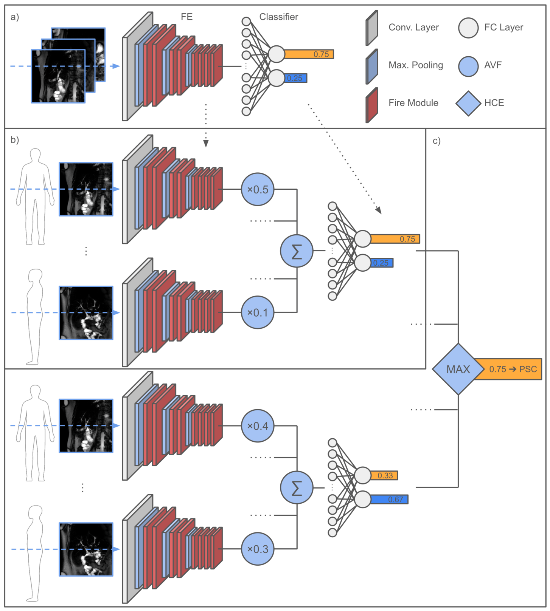

# DeePSC

<a href="https://pytorch.org/get-started/locally/"></a>
<a href="https://github.com/Project-MONAI/MONAI"></a><br>

</div>

## Description

This repository contains an exemplary implementation of the DeePSC model proposed in "DeePSC - deep learning-based decision support for the diagnosis of primary sclerosing cholangitis on 2D magnetic resonance cholangiopancreatography".

<div align="center">



</div>

## How to run

Install dependencies

```bash
# clone project
git clone https://github.com/FabianWesth/DeePSC
cd DeePSC

# create conda environment
conda create -n deepsc python=3.6 -y
conda activate deepsc

# OR

# create virtual environment
python3.6 -m venv .venv
source .venv/bin/activate

# install python requirements
pip install -r requirements.txt
```

Train DeePSC ensemble model 

```bash
# train 
python deepsc.py
```
